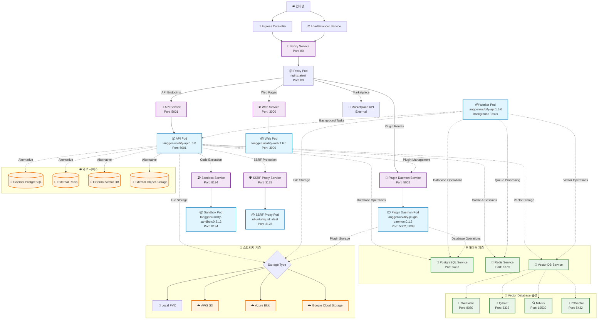

# dify-helm
[]()
[](https://github.com/BorisPolonsky/dify-helm/actions/workflows/release.yml)
[](https://artifacthub.io/packages/search?repo=dify-helm)

Deploy [langgenius/dify](https://github.com/langgenius/dify), an LLM based chat bot app on kubernetes with helm chart.

## 📚 목차

- [빠른 시작](#-빠른-시작)
- [아키텍처 개요](#-아키텍처-개요)
- [네트워크 구조](#-네트워크-구조)
- [지원 컴포넌트](#-지원-컴포넌트)
- [커스터마이징](#-커스터마이징)
- [Azure AKS 배포](#-azure-aks-배포)
- [스토리지 설정](#-스토리지-설정)
- [Vector Database 설정](#-vector-database-설정)
- [보안 및 운영](#-보안-및-운영)
- [문제 해결](#-문제-해결)

## 🚀 빠른 시작

### 기본 설치
```bash
helm repo add dify https://borispolonsky.github.io/dify-helm
helm repo update
helm install my-release dify/dify
```

### 커스텀 설정으로 설치
```bash
helm install dify ./charts/dify \
  --namespace dify \
  --create-namespace \
  -f custom-values.yaml
```

## 🏗️ 아키텍처 개요

Dify는 마이크로서비스 아키텍처로 구성되어 있으며, 각 컴포넌트가 특별한 역할을 수행합니다:

### 핵심 컴포넌트

| 컴포넌트 | 이미지 | 포트 | 역할 |
|---------|-------|------|------|
| **API** | `langgenius/dify-api:1.6.0` | 5001 | RESTful API 서버, 비즈니스 로직 처리 |
| **Web** | `langgenius/dify-web:1.6.0` | 3000 | 웹 UI 프론트엔드 |
| **Worker** | `langgenius/dify-api:1.6.0` | - | 백그라운드 작업 처리 (Celery) |
| **Sandbox** | `langgenius/dify-sandbox:0.2.12` | 8194 | 안전한 코드 실행 환경 |
| **Plugin Daemon** | `langgenius/dify-plugin-daemon:0.1.3` | 5002, 5003 | 플러그인 관리 및 실행 |
| **SSRF Proxy** | `ubuntu/squid:latest` | 3128 | 외부 요청 보안 프록시 |
| **Nginx Proxy** | `nginx:latest` | 80 | 리버스 프록시, 로드 밸런싱 |

## 🔗 네트워크 구조



### 라우팅 규칙

Nginx 프록시의 트래픽 라우팅:

```nginx
/console/api → API Service (5001)
/api         → API Service (5001)
/v1          → API Service (5001)
/files       → API Service (5001)
/mcp         → API Service (5001)
/e/          → Plugin Daemon (5002)
/explore     → Web Service (3000)
/marketplace → External Marketplace API
/            → Web Service (3000) [기본 라우트]
```

## 📦 지원 컴포넌트

### Kubernetes에서 배포 가능한 컴포넌트
- [x] core (`api`, `worker`, `sandbox`)
- [x] ssrf_proxy
- [x] proxy (via built-in `nginx` or `ingress`)
- [x] redis
- [x] postgresql
- [x] persistent storage
- [ ] object storage
- [x] weaviate
- [ ] qdrant
- [ ] milvus

### 외부 서비스 연동 지원

#### 데이터베이스
- [x] Redis
- [x] PostgreSQL

#### Object Storage
- [x] Amazon S3
- [x] Microsoft Azure Blob Storage
- [x] Alibaba Cloud OSS
- [x] Google Cloud Storage
- [x] Tencent Cloud COS
- [x] Huawei Cloud OBS
- [x] Volcengine TOS

#### Vector Database
- [x] Weaviate
- [x] Qdrant
- [x] Milvus
- [x] PGVector
- [x] Tencent Vector DB
- [x] MyScaleDB
- [x] TableStore

## 🎯 커스터마이징

### API 및 Web 이미지 커스터마이징

사용자 정의 Docker 이미지를 사용하려면 `values.yaml`을 수정하세요:

```yaml
image:
  api:
    repository: "your-registry/custom-dify-api"
    tag: "your-custom-tag"
    pullPolicy: IfNotPresent
    pullSecrets:
      - your-registry-secret
  
  web:
    repository: "your-registry/custom-dify-web"
    tag: "your-custom-tag"
    pullPolicy: IfNotPresent
    pullSecrets:
      - your-registry-secret
```

### 이미지 빌드 고려사항

#### API 이미지
- **베이스**: Python 기반
- **포트**: 5001
- **Health Check**: `/health` 엔드포인트 필요
- **환경변수**: 기존 설정 호환성 유지

#### Web 이미지
- **베이스**: Node.js 기반
- **포트**: 3000
- **Health Check**: `/apps` 엔드포인트 필요
- **빌드**: 정적 파일 서빙 설정

## ☁️ Azure AKS 배포

### Azure 특화 설정

```yaml
# Azure LoadBalancer 사용
service:
  type: LoadBalancer
  annotations:
    service.beta.kubernetes.io/azure-load-balancer-resource-group: "your-rg"
    service.beta.kubernetes.io/azure-load-balancer-internal: "true"

# Azure Disk 사용
api:
  persistence:
    enabled: true
    storageClass: "managed-premium"
    accessMode: ReadWriteOnce
    size: 50Gi

proxy:
  log:
    persistence:
      enabled: true
      storageClass: "managed-premium"
      size: 10Gi
```

### Azure 통합 서비스 활용

#### Azure Database for PostgreSQL
```yaml
externalPostgres:
  enabled: true
  username: "dify_admin"
  password: "your-secure-password"
  address: "your-postgresql.postgres.database.azure.com"
  port: 5432
  database:
    api: "dify"
    pluginDaemon: "dify_plugin"
```

#### Azure Cache for Redis
```yaml
externalRedis:
  enabled: true
  host: "your-redis.redis.cache.windows.net"
  port: 6380
  username: ""
  password: "your-redis-key"
  useSSL: true
```

### AKS 네트워킹 최적화

#### Private Cluster 설정
```yaml
ingress:
  enabled: true
  className: "azure/application-gateway"
  annotations:
    appgw.ingress.kubernetes.io/ssl-redirect: "true"
    appgw.ingress.kubernetes.io/cookie-based-affinity: "true"
  hosts:
    - host: dify.yourdomain.com
      paths:
        - path: /
          pathType: Prefix
  tls:
    - secretName: dify-tls
      hosts:
        - dify.yourdomain.com
```

## 💾 스토리지 설정

### AWS S3
```yaml
externalS3:
  enabled: true
  endpoint: "https://s3.amazonaws.com"
  accessKey: "your-access-key"
  secretKey: "your-secret-key"
  region: "us-east-1"
  bucketName:
    api: "dify-api-bucket"
    pluginDaemon: "dify-plugin-bucket"
  useIAM: false  # IAM 역할 사용 시 true
```

### Azure Blob Storage
```yaml
externalAzureBlobStorage:
  enabled: true
  url: "https://yourstorageaccount.blob.core.windows.net"
  account: "yourstorageaccount"
  key: "your-storage-key"
  container: "dify-container"
```

### Google Cloud Storage
```yaml
externalGCS:
  enabled: true
  bucketName:
    api: "dify-gcs-bucket"
    pluginDaemon: "dify-plugin-gcs-bucket"
  serviceAccountJsonBase64: "base64-encoded-service-account-json"
```

## 🧮 Vector Database 설정

### Weaviate (기본 내장)
```yaml
weaviate:
  enabled: true
  service:
    type: ClusterIP
  authentication:
    apikey:
      enabled: true
      allowed_keys:
        - "your-api-key"
```

### 외부 Weaviate
```yaml
externalWeaviate:
  enabled: true
  endpoint: "http://weaviate.example.com:8080"
  apiKey: "your-api-key"
```

### Qdrant
```yaml
externalQdrant:
  enabled: true
  endpoint: "https://your-cluster.qdrant.tech/"
  apiKey: "your-api-key"
  timeout: 20
  grpc:
    enabled: false
    port: 6334
```

### Milvus
```yaml
externalMilvus:
  enabled: true
  uri: "http://milvus.example.com:19530"
  database: 'default'
  token: "your-token"
  user: "your-username"
  password: "your-password"
```

### PGVector
```yaml
externalPgvector:
  enabled: true
  username: "postgres"
  password: "your-password"
  address: "pgvector.example.com"
  port: 5432
  dbName: "dify"
```

## 🛡️ 보안 및 운영

### 고가용성 설정

```yaml
api:
  replicas: 3
  autoscaling:
    enabled: true
    minReplicas: 2
    maxReplicas: 10
    targetCPUUtilizationPercentage: 70
  
  resources:
    requests:
      memory: "1Gi"
      cpu: "500m"
    limits:
      memory: "2Gi"
      cpu: "1000m"

worker:
  replicas: 2
  resources:
    requests:
      memory: "2Gi"
      cpu: "1000m"
    limits:
      memory: "4Gi"
      cpu: "2000m"

web:
  replicas: 2
  autoscaling:
    enabled: true
    minReplicas: 2
    maxReplicas: 5
    targetCPUUtilizationPercentage: 80
```

### 보안 설정

#### HTTPS 강제 및 보안 헤더
```yaml
proxy:
  extraEnv:
    - name: NGINX_CONF_EXTRA
      value: |
        add_header X-Frame-Options DENY;
        add_header X-Content-Type-Options nosniff;
        add_header X-XSS-Protection "1; mode=block";
        add_header Strict-Transport-Security "max-age=31536000; includeSubDomains";
```

#### Secret 관리
```yaml
api:
  extraEnv:
    - name: SECRET_KEY
      valueFrom:
        secretKeyRef:
          name: dify-secrets
          key: secret-key
    - name: DB_PASSWORD
      valueFrom:
        secretKeyRef:
          name: dify-secrets
          key: db-password
```

### 모니터링 설정

#### Prometheus 메트릭
```yaml
redis:
  metrics:
    enabled: true
    serviceMonitor:
      enabled: true
      interval: 30s
      
postgresql:
  metrics:
    enabled: true
    serviceMonitor:
      enabled: true
```

#### Health Checks
```yaml
api:
  livenessProbe:
    enabled: true
    initialDelaySeconds: 30
    periodSeconds: 30
    timeoutSeconds: 5
    failureThreshold: 5
  readinessProbe:
    enabled: true
    initialDelaySeconds: 10
    periodSeconds: 10
    timeoutSeconds: 5
    failureThreshold: 5
```

## 🔧 문제 해결

### 일반적인 문제들

#### Pod 시작 실패
```bash
# Pod 상태 확인
kubectl get pods -n dify

# 로그 확인
kubectl logs -f deployment/dify-api -n dify

# 이벤트 확인
kubectl describe pod <pod-name> -n dify
```

#### 데이터베이스 연결 문제
```bash
# 데이터베이스 연결 테스트
kubectl run --rm -it --restart=Never postgres-client \
  --image=postgres:13 --namespace=dify \
  -- psql -h dify-postgresql -U postgres -d dify
```

#### 스토리지 권한 문제
```bash
# PVC 상태 확인
kubectl get pvc -n dify

# 스토리지 클래스 확인
kubectl get storageclass
```

### 성능 최적화

#### 리소스 모니터링
```bash
# 리소스 사용량 확인
kubectl top pods -n dify
kubectl top nodes
```

#### 캐시 최적화
```yaml
redis:
  master:
    persistence:
      enabled: true
      size: 8Gi
    resources:
      requests:
        memory: 2Gi
        cpu: 500m
      limits:
        memory: 4Gi
        cpu: 1000m
```

## 📈 운영 가이드

### 업그레이드
```bash
# Helm 차트 업데이트
helm repo update

# 업그레이드 실행
helm upgrade dify dify/dify -f custom-values.yaml
```

### 백업
```bash
# PostgreSQL 백업
kubectl exec -n dify dify-postgresql-0 -- pg_dump -U postgres dify > backup.sql

# Redis 백업
kubectl exec -n dify dify-redis-master-0 -- redis-cli BGSAVE
```

### 스케일링
```bash
# 수동 스케일링
kubectl scale deployment dify-api --replicas=5 -n dify

# HPA 확인
kubectl get hpa -n dify
```

## 🤝 Contributors

<a href="https://github.com/borispolonsky/dify-helm/graphs/contributors">
  
</a>

## 📄 라이선스

이 프로젝트는 MIT 라이선스 하에 배포됩니다. 자세한 내용은 [LICENSE](LICENSE) 파일을 참조하세요.

## 🆘 지원

문제가 발생하거나 질문이 있으시면:

1. [GitHub Issues](https://github.com/borispolonsky/dify-helm/issues)에 문의
2. [Discussions](https://github.com/borispolonsky/dify-helm/discussions)에서 커뮤니티와 소통
3. [Artifact Hub](https://artifacthub.io/packages/search?repo=dify-helm)에서 패키지 정보 확인

---

⭐ 이 프로젝트가 도움이 되었다면 Star를 눌러주세요!

