# dify-helm

[]()
[](https://github.com/BorisPolonsky/dify-helm/actions/workflows/release.yml)
[](https://artifacthub.io/packages/search?repo=dify-helm)

Deploy [langgenius/dify](https://github.com/langgenius/dify), an LLM based chat bot app on kubernetes with helm chart.

## Installation

```shell
helm repo add dify https://borispolonsky.github.io/dify-helm
helm repo update
helm install my-release dify/dify
```

## Network Architecture

The following diagram illustrates the complete network architecture and service topology of the Dify Helm deployment:

```mermaid
graph TB
    %% External Traffic Entry Points
    Internet[🌐 Internet] --> Ingress[🚪 Ingress Controller]
    Internet --> LB[⚖️ LoadBalancer Service]

    %% Main Traffic Flow
    Ingress --> ProxyService[🔄 Proxy Service<br/>Port: 80]
    LB --> ProxyService

    %% Proxy Pod and Routing
    ProxyService --> ProxyPod[📦 Proxy Pod<br/>nginx:latest<br/>Port: 80]

    %% Backend Services Routing
    ProxyPod -->|API Endpoints| APIService[🔧 API Service<br/>Port: 5001]
    ProxyPod -->|Web Pages| WebService[🌐 Web Service<br/>Port: 3000]
    ProxyPod -->|Plugin Routes| PluginService[🔌 Plugin Daemon Service<br/>Port: 5002]
    ProxyPod -->|Marketplace| MarketplaceAPI[🛒 Marketplace API<br/>External]

    %% Backend Pods
    APIService --> APIPod[📦 API Pod<br/>langgenius/dify-api:1.7.1<br/>Port: 5001]
    WebService --> WebPod[📦 Web Pod<br/>langgenius/dify-web:1.7.1<br/>Port: 3000]
    PluginService --> PluginPod[📦 Plugin Daemon Pod<br/>langgenius/dify-plugin-daemon:0.1.3<br/>Port: 5002, 5003]

    %% Worker Pod (Background Processing)
    WorkerPod[📦 Worker Pod<br/>langgenius/dify-api:1.7.1<br/>Background Tasks]

    %% Celery Beat Pod (Scheduled Tasks)
    BeatPod[📦 Beat Pod<br/>langgenius/dify-api:1.7.1<br/>Scheduled Tasks]

    %% Sandbox Service
    SandboxService[🏖️ Sandbox Service<br/>Port: 8194] --> SandboxPod[📦 Sandbox Pod<br/>langgenius/dify-sandbox:0.2.12<br/>Port: 8194]

    %% SSRF Proxy Service
    SSRFService[🛡️ SSRF Proxy Service<br/>Port: 3128] --> SSRFPod[📦 SSRF Proxy Pod<br/>ubuntu/squid:latest<br/>Port: 3128]

    %% Internal Communications
    APIPod -.->|Code Execution| SandboxService
    APIPod -.->|SSRF Protection| SSRFService
    APIPod -.->|Plugin Management| PluginService
    WorkerPod -.->|Background Tasks| APIPod

    %% Data Layer - Databases
    subgraph DataLayer [🗄️ Data Layer]
        PostgresService[🐘 PostgreSQL Service<br/>Port: 5432]
        RedisService[🔴 Redis Service<br/>Port: 6379]
        WeaviateService[🌊 Weaviate Service<br/>Port: 8080]
    end

    %% Database Connections
    APIPod -.->|Database Operations| PostgresService
    WorkerPod -.->|Database Operations| PostgresService
    PluginPod -.->|Database Operations| PostgresService
    BeatPod -.->|Database Operations| PostgresService

    APIPod -.->|Cache & Sessions| RedisService
    WorkerPod -.->|Queue Processing| RedisService
    BeatPod -.->|Task Scheduling| RedisService

    APIPod -.->|Vector Storage| WeaviateService
    WorkerPod -.->|Vector Operations| WeaviateService

    %% Storage Layer
    subgraph StorageLayer [💾 Storage Layer]
        StorageType{Storage Type}
        LocalPVC[📁 Local PVC]
        S3Storage[☁️ AWS S3]
        AzureStorage[☁️ Azure Blob]
        GCSStorage[☁️ Google Cloud Storage]
    end

    %% Storage Connections
    APIPod -.->|File Storage| StorageType
    WorkerPod -.->|File Storage| StorageType
    PluginPod -.->|Plugin Storage| StorageType

    StorageType --> LocalPVC
    StorageType --> S3Storage
    StorageType --> AzureStorage
    StorageType --> GCSStorage

    %% External Dependencies
    subgraph ExternalServices [🌐 External Services]
        ExternalDB[(🔧 External PostgreSQL)]
        ExternalRedis[(🔴 External Redis)]
        ExternalVector[(🧮 External Vector DB)]
        ExternalStorage[(💾 External Object Storage)]
    end

    %% External Service Connections (Alternative)
    APIPod -.->|Alternative| ExternalDB
    APIPod -.->|Alternative| ExternalRedis
    APIPod -.->|Alternative| ExternalVector
    APIPod -.->|Alternative| ExternalStorage
    
    ExternalVector -.-> Qdrant
    ExternalVector -.-> Milvus
    ExternalVector -.-> PGVector

    %% Styling
    classDef podClass fill:#e1f5fe,stroke:#0277bd,stroke-width:2px
    classDef serviceClass fill:#f3e5f5,stroke:#7b1fa2,stroke-width:2px
    classDef storageClass fill:#e8f5e8,stroke:#2e7d32,stroke-width:2px
    classDef externalClass fill:#fff3e0,stroke:#ef6c00,stroke-width:2px

    class APIPod,WebPod,WorkerPod,BeatPod,SandboxPod,SSRFPod,PluginPod podClass
    class APIService,WebService,SandboxService,SSRFService,PluginService,ProxyService,WeaviateService serviceClass
    class PostgresService,RedisService,WeaviateService storageClass
    class ExternalDB,ExternalRedis,ExternalVector,ExternalStorage,S3Storage,AzureStorage,GCSStorage,Qdrant,Milvus,PGVector externalClass
```



### Traffic Routing Rules

The Nginx proxy handles traffic routing with the following rules:

```nginx
/console/api → API Service (5001)
/api         → API Service (5001)
/v1          → API Service (5001)
/files       → API Service (5001)
/mcp         → API Service (5001)
/e/          → Plugin Daemon (5002)
/explore     → Web Service (3000)
/marketplace → External Marketplace API
/            → Web Service (3000) [Default Route]
```

### Core Components

| Component | Image | Port | Role |
|-----------|-------|------|------|
| **API** | `langgenius/dify-api:1.7.1` | 5001 | RESTful API server, business logic processing |
| **Web** | `langgenius/dify-web:1.7.1` | 3000 | Web UI frontend |
| **Worker** | `langgenius/dify-api:1.7.1` | - | Background task processing (Celery) |
| **Sandbox** | `langgenius/dify-sandbox:0.2.12` | 8194 | Secure code execution environment |
| **Plugin Daemon** | `langgenius/dify-plugin-daemon:0.1.3` | 5002, 5003 | Plugin management and execution |
| **SSRF Proxy** | `ubuntu/squid:latest` | 3128 | External request security proxy |
| **Nginx Proxy** | `nginx:latest` | 80 | Reverse proxy, load balancing |

## Supported Component

### Components that could be deployed on kubernetes in current version

- [x] core (`api`, `worker`, `sandbox`)
- [x] ssrf_proxy
- [x] proxy (via built-in `nginx` or `ingress`)
- [x] redis
- [x] postgresql
- [x] persistent storage
- [ ] object storage
- [x] weaviate
- [ ] qdrant
- [ ] milvus

### External components that can be used by this app with proper configuration

- [x] Redis
- [x] PostgreSQL
- Object Storage:
  - [x] Amazon S3
  - [x] Microsoft Azure Blob Storage
  - [x] Alibaba Cloud OSS
  - [x] Google Cloud Storage
  - [x] Tencent Cloud COS
  - [x] Huawei Cloud OBS
  - [x] Volcengine TOS
- External Vector DB:
  - [x] Weaviate
  - [x] Qdrant
  - [x] Milvus
  - [x] PGVector
  - [x] Tencent Vector DB
  - [x] MyScaleDB
  - [x] TableStore

## ExternalSecret Support

### Background

In Kubernetes production environments, storing sensitive information (such as database passwords, API keys, etc.) directly in values.yaml is insecure. The ExternalSecret feature solves this problem through the [External Secrets Operator](https://external-secrets.io/), which can securely retrieve sensitive information from external secret management systems (such as AWS Secrets Manager, HashiCorp Vault, Azure Key Vault, etc.) and automatically create Kubernetes Secret resources.

Why ExternalSecret is needed:

- **Security**: Avoid storing plain text passwords in Git repositories or configuration files
- **Centralized Management**: Unified management of all sensitive information
- **Automatic Rotation**: Support for automatic key updates and rotation
- **Compliance**: Meet enterprise security and compliance requirements

### Currently Supported External Components

When ExternalSecret is enabled, sensitive information for the following components can be retrieved from external secret stores:

#### Database Connections

- **PostgreSQL**: Database username, password
- **Redis**: Authentication password, username
- **Elasticsearch**: Username, password

#### Object Storage

- **AWS S3**: Access Key ID, Secret Access Key

#### Vector Databases

- **ElasticSearch**: Username, Password

#### Email Services

- **Resend**: API Key, sender email
- **SendGrid**: API Key, sender email

#### Other Services

- **Code Execution Service**: API Key
- **Plugin System**: Daemon Key, internal API Key
- **Application Core**: Secret Key

Usage: Set `externalSecret.enabled: true` in values.yaml and configure the corresponding secretStore and remoteRefs parameters.

## Contributors

<a href="https://github.com/borispolonsky/dify-helm/graphs/contributors">
  
</a>
