# dify-helm

[]()
[](https://github.com/BorisPolonsky/dify-helm/actions/workflows/release.yml)
[](https://artifacthub.io/packages/search?repo=dify-helm)

Deploy [langgenius/dify](https://github.com/langgenius/dify), an LLM-based chatbot app on Kubernetes with Helm chart.

## Prerequisites
- **Kubernetes**: 1.23+
- **Helm**: 3.12+

## Installation
### TL;DR
```shell
helm repo add dify https://borispolonsky.github.io/dify-helm
helm repo update
helm install my-release dify/dify
```
For customized installation, please refer to the [README.md](https://github.com/BorisPolonsky/dify-helm/blob/master/charts/dify/README.md) file.

## Network Architecture

The following diagram illustrates the complete network architecture and service topology of the Dify Helm deployment:

```mermaid
graph TB
    %% External Traffic Entry Points
    Internet[🌐 Internet] --> Ingress[🚪 Ingress Controller]
    Internet --> LB[⚖️ LoadBalancer Service]

    %% Main Traffic Flow
    Ingress --> ProxyService[🔄 Proxy Service<br/>Port: 80]
    LB --> ProxyService

    %% Proxy Pod and Routing
    ProxyService --> ProxyPod[📦 Proxy Pod<br/>nginx:latest<br/>Port: 80]

    %% Backend Services Routing
    ProxyPod -->|API Endpoints| APIService[🔧 API Service<br/>Port: 5001]
    ProxyPod -->|Web Pages| WebService[🌐 Web Service<br/>Port: 3000]
    ProxyPod -->|Plugin Routes| PluginService[🔌 Plugin Daemon Service<br/>Port: 5002]
    ProxyPod -->|Marketplace| MarketplaceAPI[🛒 Marketplace API<br/>External]

    %% Backend Pods
    APIService --> APIPod[📦 API Pod<br/>langgenius/dify-api:1.10.1<br/>Port: 5001]
    WebService --> WebPod[📦 Web Pod<br/>langgenius/dify-web:1.10.1<br/>Port: 3000]
    PluginService --> PluginPod[📦 Plugin Daemon Pod<br/>langgenius/dify-plugin-daemon:0.4.1-local<br/>Ports: 5002, 5003]

    %% Worker Pod (Background Processing)
    WorkerPod[📦 Worker Pod<br/>langgenius/dify-api:1.10.1]

    %% Beat Pod (Periodic task scheduler)
    BeatPod[📦 Beat Pod<br/>langgenius/dify-api:1.10.1]

    %% Sandbox Service
    SandboxService[🏖️ Sandbox Service<br/>Port: 8194] --> SandboxPod[📦 Sandbox Pod<br/>langgenius/dify-sandbox:0.2.12<br/>Port: 8194]

    %% SSRF Proxy Service
    SSRFService[🛡️ SSRF Proxy Service<br/>Port: 3128] --> SSRFPod[📦 SSRF Proxy Pod<br/>ubuntu/squid:latest<br/>Port: 3128]

    %% Internal Communications
    APIPod -.->|Code Execution| SandboxService
    APIPod -.->|SSRF Protection| SSRFService
    APIPod -.->|Plugin Management| PluginService
    WorkerPod -.->|Background Tasks| APIPod

    %% Data Layer - Databases
    subgraph DataLayer [🗄️ Data Layer]
        PostgresService[🐘 PostgreSQL Service<br/>Port: 5432]
        RedisService[🔴 Redis Service<br/>Port: 6379]
        VectorDBService[🧮 Vector DB Service]
    end

    %% Database Connections
    APIPod -.->|Database Operations| PostgresService
    WorkerPod -.->|Database Operations| PostgresService
    PluginPod -.->|Database Operations| PostgresService

    APIPod -.->|Cache & Sessions| RedisService
    WorkerPod -.->|Task Processing| RedisService
    BeatPod -.->|Task Scheduling| RedisService

    APIPod -.->|Vector Storage| VectorDBService
    WorkerPod -.->|Vector Operations| VectorDBService

    %% Storage Layer
    subgraph StorageLayer [💾 Storage Layer]
        StorageType{Storage Type}
        LocalPVC[📁 Local PVC]
        S3Storage[☁️ AWS S3]
        AzureStorage[☁️ Azure Blob]
        GCSStorage[☁️ Google Cloud Storage]
    end

    %% Storage Connections
    APIPod -.->|File Storage| StorageType
    WorkerPod -.->|File Storage| StorageType
    PluginPod -.->|Plugin Storage| StorageType

    StorageType --> LocalPVC
    StorageType --> S3Storage
    StorageType --> AzureStorage
    StorageType --> GCSStorage

    %% Vector Database Options
    subgraph VectorOptions [🧮 Vector Database Options]
        WeaviateDB[🌊 Weaviate<br/>Port: 8080]
        QdrantDB[⚡ Qdrant<br/>Port: 6333]
        MilvusDB[🔍 Milvus<br/>Port: 19530]
        PGVectorDB[🐘 PGVector<br/>Port: 5432]
    end

    VectorDBService -.-> WeaviateDB
    VectorDBService -.-> QdrantDB
    VectorDBService -.-> MilvusDB
    VectorDBService -.-> PGVectorDB

    %% External Dependencies
    subgraph ExternalServices [🌐 External Services]
        ExternalDB[(🔧 External PostgreSQL/MySQL)]
        ExternalRedis[(🔴 External Redis)]
        ExternalVector[(🧮 External Vector DB)]
        ExternalStorage[(💾 External Object Storage)]
    end

    %% External Service Connections (Alternative)
    APIPod -.->|Alternative| ExternalDB
    APIPod -.->|Alternative| ExternalRedis
    APIPod -.->|Alternative| ExternalVector
    APIPod -.->|Alternative| ExternalStorage

    %% Styling
    classDef podClass fill:#e1f5fe,stroke:#0277bd,stroke-width:2px
    classDef serviceClass fill:#f3e5f5,stroke:#7b1fa2,stroke-width:2px
    classDef storageClass fill:#e8f5e8,stroke:#2e7d32,stroke-width:2px
    classDef externalClass fill:#fff3e0,stroke:#ef6c00,stroke-width:2px

    class APIPod,WebPod,WorkerPod,BeatPod,SandboxPod,SSRFPod,PluginPod podClass
    class APIService,WebService,SandboxService,SSRFService,PluginService,ProxyService serviceClass
    class PostgresService,RedisService,VectorDBService,WeaviateDB,QdrantDB,MilvusDB,PGVectorDB storageClass
    class ExternalDB,ExternalRedis,ExternalVector,ExternalStorage,S3Storage,AzureStorage,GCSStorage externalClass
```



### Traffic Routing Rules

The Nginx proxy handles traffic routing with the following rules:

```nginx
/console/api → API Service (5001)
/api         → API Service (5001)
/v1          → API Service (5001)
/files       → API Service (5001)
/mcp         → API Service (5001)
/e/          → Plugin Daemon (5002)
/explore     → Web Service (3000)
/marketplace → External Marketplace API
/triggers    → API Service (5001)
/            → Web Service (3000) [Default Route]
```

### Core Components

| Component | Image | Port | Role |
|-----------|-------|------|------|
| **API** | `langgenius/dify-api:1.10.1` | 5001 | RESTful API server, business logic processing |
| **Web** | `langgenius/dify-web:1.10.1` | 3000 | Web UI frontend |
| **Worker** | `langgenius/dify-api:1.10.1` | - | Background task processing (Celery) |
| **Beat** | `langgenius/dify-api:1.10.1` | - | Periodic task scheduler (Celery Beat) |
| **Sandbox** | `langgenius/dify-sandbox:0.2.12` | 8194 | Secure code execution environment |
| **Plugin Daemon** | `langgenius/dify-plugin-daemon:0.4.1-local` | 5002, 5003 | Plugin management and execution |
| **SSRF Proxy** | `ubuntu/squid:latest` | 3128 | External request security proxy |
| **Nginx Proxy** | `nginx:latest` | 80 | Reverse proxy, load balancing |

### Supported External Components
- [x] Redis (Standalone and Sentinel)
- [x] External Database
  - [x] PostgreSQL
  - [x] MySQL
- [x] Object Storage:
  - [x] Amazon S3
  - [x] Microsoft Azure Blob Storage
  - [x] Alibaba Cloud OSS
  - [x] Google Cloud Storage
  - [x] Tencent Cloud COS
  - [x] Huawei Cloud OBS
  - [x] Volcengine TOS
- [x] External Vector DB:
  - [x] Weaviate
  - [x] Qdrant
  - [x] Milvus
  - [x] PGVector
  - [x] Tencent Vector DB
  - [x] MyScaleDB
  - [x] TableStore
  - [x] Elasticsearch

## Contributors

<a href="https://github.com/borispolonsky/dify-helm/graphs/contributors">
  
</a>
